# Udemy docker and k8 course


## Section 1

**Docker how it works**:

the __docker run__ command looks like local images first and if it can’t find them, looks to docker hub.

Docker makes use of a container, which you think of as a allocated amount of system reosurces devoted to a process or set of process.

The kernel looks at the system call and looks at the calling application and directs it to a segment of the computer resources. Called namespacing. Namespacing allows you to devote hardware resource to a the calling process. It isolates resources per process.

A control group can limit the amount of hard resources a process can use. It can limit how much cpu and memory a process can use. even network bandwidth.

control group and namespacing together can really affect processes. A container from docker utilizes both of these. a container is a grouping of processes that have a grouping of resources assigned to it.

hello
The kernel is repsonsible for looking at the process system call and directing it to the necessary resources.

this is what happens when you run docker run.
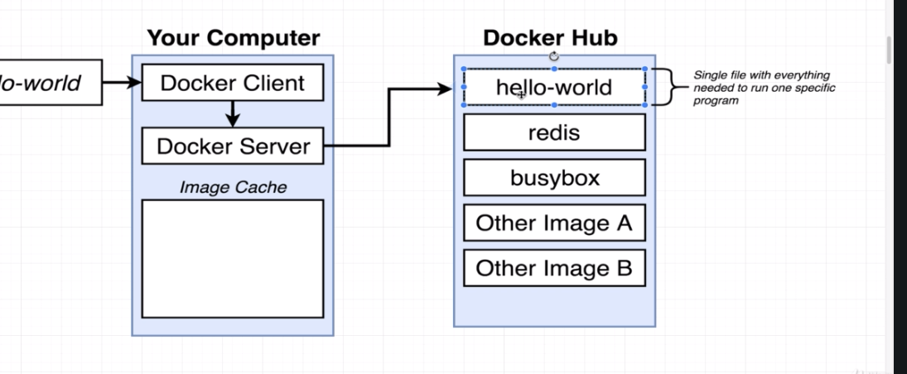

and this is how a container would work
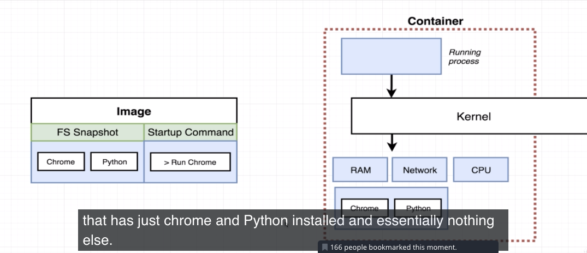


# Section 3

## Notes
When running docker build, each step in run inside and intermediate container and the output of a step is a new image that is used for the next step. At every step, you output an image with a new file system and new command

## New commands
instead of pasting an id everytime, use an ID or tag using the -t flag.

```
docker build -t jwan/redis:latest .
```
- the trailing . is the build context for `build` command... source of all files and folders to be used to build container out.
-the above command tags an image. now we can run it using the tag.

```
docker build -t jwan/redis:latest
```

Basic Dockerfile:
From alpine
Run apk add --update redis
CMD ["redis-server"]


## New Dockerfile commands


# Section 4

the : specifies an image tag:

```
FROM node:alpine

RUN npm install

CMD ["npm", "start"]
```

"alpine" is a tag, not a repository in this case. alpine means the most bare version of a repo, small and compact as possible. no preinstalled programs like git or text editing.

If you have extra files that need to be stored in the container, you have to move them there yourself.
For ex, package.json file has to be moved into the container if your docker command or RUN is npm install. So add this to your Dockerfile using the COPY commmand:

```
FROM node:alpine

# Install some dependencies
COPY ./ ./
RUN npm install

# default command
CMD ["npm", "start"]
```


## Notes


#### TAgging
tag alpine means smallest image possible. Tags come after a colon after the repo name.

- copy command moves files from our machine to temp container during build process.
COPY ./ ./folder moves everything in currenet working directory on computer to ./folder in container.
the first argument to COPY is a path on our computer, the second is a path in the container.

#### setup port mapping
- by default no traffic into our machine goes into the container, have to setup port mapping for that to happen. Container has its own isolated set of ports, but by default no traffic to our comp is directed into the container. Port mapping -anytime a request is made to local network is forwarded to container.
- specified during runtime during the run command.
if anyone makes an incoming local network request to some port inside container:
- containers can reach out (clearly because it can install) but traffic into the container is limited.
- no limitation of container to reach out to the world, just a limitation to reach into the container.

```
docker run -p 8080:8080 <image_name_or_id>
```

port forwarding command
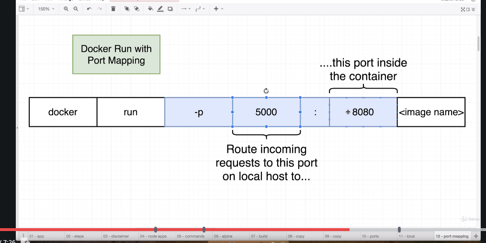

This is conceptually what the run command is doing:


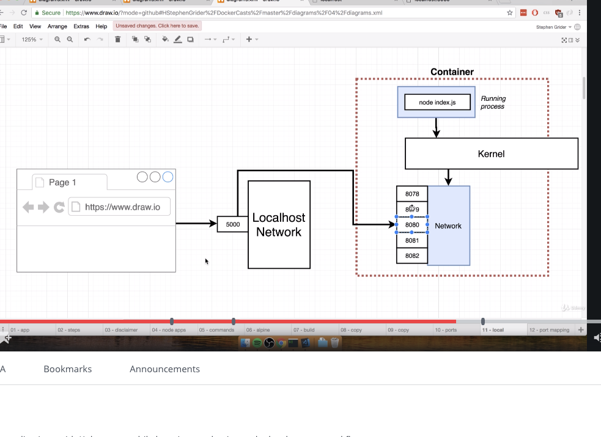

- the second number is the port inside the container. first number is localhost.
- ports can also be different.


#### working directory

- instead of copying all files into the top level, you can specify a nested working directory to avoid conflicts with the top level directories.
- the instruction is WORKDIR into the Dockerfile. any following commands will be executed relative to this folder. So 
WORKDIR /usr/app
COPY ./ ./

that will create /usr/app and then copy will copy everything from computer directory root to /usr/app.

#### prevent unnecessary rebuilds:
```
FROM node:alpine

# makes future commands relative to this folder
WORKDIR /usr/app

# Install some dependencies
COPY ./package.json ./
RUN npm install
COPY ./ ./

# default command
CMD ["npm", "start"]
```

the COPY command looks at local package.json specified by the build context argument of `docker run` and copies them over to the WORKDIR. Notice the second argument just has to be ./ and not ./package.json
- by splitting copy up into two commands, any changes to index.js will only bust cache of second COPY and npm install will not run again unless the package.json changes.


## Section 4 commands

runs a shell after running an image:
```
docker run -it <image_name> sh
```


-to run a second command inside a process, in this case a sh shell: (-it is for interactive)
```
docker exec -it <container_id> sh
```

## Section 4 new Dockerfile commands
WORKDIR - any future commands in dockerfile will be relative to this folder that we specify. So maybe we don't put copy our files into the root directory of the container.
-workdir also affects commands that affect the container issued through command line like docker exec -it <container_id> sh... it sh's into the folder. It affects commands that are exectued through the `exec` command.

```
FROM node:alpine

# makes future commands relative to this folder
WORKDIR /usr/app

# Install some dependencies
COPY ./ ./
RUN npm install

# default command
CMD ["npm", "start"]
```


# Section 5

## Notes

- So imagine if you put node and redis in the same image. Say the app keeps track of visits. The problem is thatif this scales and you have to spin up more containers, each container has its own separate and siloed redis server. So the number of visits would be siloed and no one redis would have the true count of all visits. That's a problem. Instead you should separate out the redis and node containers so you can scale the node server but not the redis server.

- when running `docker run`, no need to put in the tag like latest.

- if you run the node application and the redis server in separate containers, these two containers have no automatic communication between the two. isolated processes with no communication. So... setup network infrastructure, you have two options: 1) use docker cli that can setup a network between two containers, it's a pain in the ass 2) docker compose. docker compose is a separate CLI and is installed. docker compose exists to help you not repeat repetitive commands with docker CLI. Docker compose can also very eailsy startup multiple docker containers and auto connect them with some kind of networking, it functions as teh CLI and issues multiple commands quickly.

- `docker-compose.yml` file has special syntax and the file will be fed into docker-compose CLI and will setup the containers with the configs.

- services in docker-compose world means container, sort of. It's a type of contianer really called a service.

```yml
version: '3'
services:
  redis-server:
    image: 'redis'
  node-app:
    build: .
    ports:
      - "4001:8080"
```

the above builds a container using an image from docker hub and a Dockerfile locally.
- the array is a dash because there can be multiple port mappings. the first number 4001 is a port on our local machine, 8080 is the port in the container. 

-docker compose will create the containers on the same network so the two can exchange info without having to open ports between the two. the port declaration in node-app is for our machine to access the container, but not for the containers to access each other.


- So how do we access redis server from node js code? in our index.js, this code:

```javascript
const client = redis.createClient({
    host: 'redis-server'
});
```

will be intercepted by Docker and it will handle the resolution of that request.


- restart policy for docker-compose. No, always, on-failure, unless-stopped.

## New commands

`docker run <image>` is replaced by `docker-compose up`. `docker-compose up` will create all the services or images in our `docker-compose.yml` file.

`docker build .` and `docker run <image>` is replaced by `docker-compose up --build`

`docker-compose up -d` starts up group of containers in the background
`docker-compose down` stops all of the containers.

`docker-compose ps` is like docker ps but needs to be run from directory with docker-compose.yml directory.

## New Dockerfile commands


# Section 6

## Notes

- How can you make changes to the source code to cleverly show up in the container without having to stop the container, and rebuild it, and restart it. The container doesn't update when you make changes to local code. Docker volumes - setup a placeholder in the container. IT has references instead of folders. the placeholders point back to local machine. Volume can be thought of as port mappings but to local resources.

- Use a new command to do this: docker run -p 3000:3000 -v $(pwd):/app <image_id>

- the best thing about using docker compose and volumes is that they rerun when changes are made to the app files.
- multistep dockerfiles allow us to do a build with one image, and run with another like nginx.

## New commands

`docker build -f Dockerfile.dev .` can specify a new dockerfile to build from.

`docker run -p 3000:3000 -v /app/node_modules -v $(pwd):/app <image>` runs a docker container with an image that maps the present working directory files on local to the app folder in the container but it also doesn't touch the /app/node_modules folder and keeps a bookmark so it doesn't get overwritten. We can replace this with a docker compose command instead. Bookmarking is like holding onto the volume inside of the container so it doesn't get deleted.

To run tests:
`docker run -it <tag> npm run test` the -it flag hooks the container up to standard in so we can run npm test commands in the container when it prompts us. standard out is already hooked up by default.

to override command and run test and have it be interactive:
`docker run -it <image> npm run test`

`docker exec -it <container> sh`
- that executes an run a command in the container and starts a shell and a connection to standard in with -it.

`docker attach <container>`
- attaches to standard in and out of primary process.. always attaches to primary process of container, not sub processes like test suites. so that's why tehre's that shortcoming of testing in docker containers and why interactive commands don't work. we atatched to the wrong process in the container.

## New Dockerfile commands


- if you do `FROM node:alpine as builder`, it means everything after this will be known as the builder phase. If there's is another `FROM` in a Dockerfile, then it starts another phase and it completes the previous block.
- doing `COPY . .` is fine during the build phase because we won't be changing our source code further. We use volumes when we want to develop faster and see our code changes immediately. 

```Docker
FROM node:alpine as builder

WORKDIR '/app'

COPY package.json .

RUN npm install

COPY . .

RUN npm run build


FROM nginx
COPY --from=builder /app/build /usr/share/nginx/html

```
two phases, the second phase just throws out everything except for the build folder which is created when `npm run build` is run.
- `COPY --from=builder /app/build /usr/share/nginx/html` we copy everything from the builder phase from the /app/build folder to the appropriate nginx folder is used by nginx to serve static content. `COPY --from` specifies the phase builder.

-to run the above run `docker build .` and then `docker run -p 8080:80 fed9975d68c6`
- now we have a production application with nginx!


when we visit `localhost:8080` we see:

```text
docker run -p 8080:80 fed9975d68c6
172.17.0.1 - - [16/Dec/2019:16:18:39 +0000] "GET / HTTP/1.1" 200 2217 "-" "Mozilla/5.0 (Macintosh; Intel Mac OS X 10_14_5) AppleWebKit/537.36 (KHTML, like Gecko) Chrome/77.0.3865.120 Safari/537.36" "-"
172.17.0.1 - - [16/Dec/2019:16:18:39 +0000] "GET /static/js/2.dd1fcc93.chunk.js HTTP/1.1" 200 130053 "http://localhost:8080/" "Mozilla/5.0 (Macintosh; Intel Mac OS X 10_14_5) AppleWebKit/537.36 (KHTML, like Gecko) Chrome/77.0.3865.120 Safari/537.36" "-"
172.17.0.1 - - [16/Dec/2019:16:18:39 +0000] "GET /static/css/main.d1b05096.chunk.css HTTP/1.1" 200 1051 "http://localhost:8080/" "Mozilla/5.0 (Macintosh; Intel Mac OS X 10_14_5) AppleWebKit/537.36 (KHTML, like Gecko) Chrome/77.0.3865.120 Safari/537.36" "-"
172.17.0.1 - - [16/Dec/2019:16:18:39 +0000] "GET /static/js/main.649334a6.chunk.js HTTP/1.1" 200 1134 "http://localhost:8080/" "Mozilla/5.0 (Macintosh; Intel Mac OS X 10_14_5) AppleWebKit/537.36 (KHTML, like Gecko) Chrome/77.0.3865.120 Safari/537.36" "-"
```

# Section 7

## Notes

- my work for section 7 with travis and AWS is in git@github.com:Jwan622/docker-react.git
- Travis can pull github repo with new changes and do any work like test, deploy, delete it all if you want. Traditionally for testing and deployment to AWS.
- travis will use the Dockerfile.dev from section 6 because only it has the test suite. The production Dockerfile gets rid of it and only keeps the app/build folder.

- for travis to use docker, it needs superlevel permissions so `sudo:required` is in the `.travis.yml` file.
- in `.travis.yml`, the `services: - Docker` is to help Travis understand it needs Docker installed.
- AWS Elastic Beanstalk will scale everything up for us using a load balancer and it will spin up more VMs with our container  as traffic reaches a threshold. Requests go to the load balancer first.

- in `.traviss.yml`

```text

before_install:
  - docker build -f Dockerfile.dev .
```

the above tells to find the Dockerfile.dev in the current context with the .

- need to tag it because travis won't copy paste it for you. Use a tag
- the `.travis.yml` file has to be toplevel in teh github repo, mine was not and I was stuck for a while because I'm an idiot.

- So how do you have travis deploy to AWS once tests have pass? We can add to the `.travis.yml`

```text
deploy:
  provider: elasticbeanstalk
```

that helps travis deploy to AWS ESB.

- When travis deploys, it takes the files inside github repo, zips them, and sends them to s3, thats why we need to specify a `bucket_Name` in our travis deploy section. whebn it's uploaded, travis will poke ESB (elastic beanstalk) and say it's uplaoded, and ESB will then take the zip file from the bucket. That's why we need to specify the bucket_name in the travis file. Find the bucket in s3.

```text
deploy:
  provider: elasticbeanstalk
  region: "us-east-1"
  app: "docker-react"
  env: "Docker-env"
  bucket_name: "elasticbeanstalk-us-east-1-516088479088"
  bucket_path: "docker-react"
  on:
    branch: master
```

the bucket_path is the name of the path/folder that will be created in the bucket_name. It will created teh first time we deploy. the `on master` part tells travis to only deploy when the master branch is updated with new code, not feature branches.

__ON AWS ESB__
- an application is a common set of configs that houses environments but the environment is the actual application. 

__ON IAM__
- programmtic access in IAM is for when you never access it via the AWS console, jsut through network requests.
- you can add policies directly to user or to a group. when creating a user for travis, we can attach policy directly.
- we need to include AWS keys into travis CI because we're allowing travis CI to access resources in our AWS account. That's why we put AWS keys in our `.travis.yml` file.

- takeaway from this is that docker made deployment easier. In our `travis.yml` file, all we had to do was a before install and script that had a `docker build` and a `docker run` command that had an override to run tests. The rest of the file can be the same if you swap out a different image in the build step. So docker images simplify deployment because you just have to specify the image.
- I did get this all working!
## New commands
## New Dockerfile commands

`EXPOSE 80` on our laptop does nothing and it's more communication to developers. BUT AWS beanstalk will look for expose instruction and will ESB will port map automatically from the load balancer to this port.


# Section 8

## Notes

- we're building this:

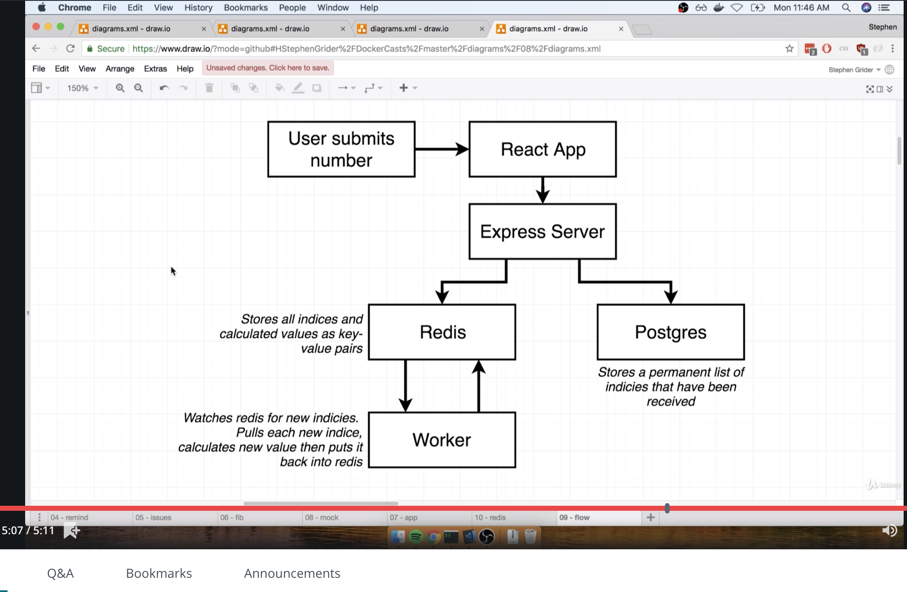

- a few things, redis is needed to store the index of the fibonacci sequence, not the values themselves. the worker pulls the index and calculates the fibonacci value slowly which is why the worker adn redis are needed. postgres will store the fib indices that have already been calculated. This is a multicontainer application that will have several containers talking to each other.47

- problem with section 7 is that travis was building the image and so was AWS ESB (elastic beanstalk), why build the image twice? Our web server was building the image which seems like a nono.


## New commands
## New Dockerfile commands


# Section 9

## Notes
- dev containers should change when there's source code changes. it makes for the workflow to be smooth. So we won't have to rebuild the image each time. Use volumes through docker compose.
- nginx can route. It will take requests with `/api/something/sometihng` with api in front and route them to the node server. Other requests will get sent to react. Thats' why nginx sits in the middle. all requests go to nginx and it routes to different services. Look up `nginx patyh routing` in the udemy course.
- an upstream server is one behind nginx, a server that nginx can redirect traffic to.

```text
upstream client {
    server client:3000;
}

upstream api {
    server api:5000;
}
```

- remember that the domains of the docker services are craeted in the docker compose yml file... the names of the services there act as domains. So we can use those as addresses in teh nginx `default.conf` file
## New commands
## New Dockerfile commands

```yml
FROM nginx
COPY default.conf /etc/nginx/conf.d/default.conf
```

The above copy a config file into the container/image. And if we don't provide a run command of an image, than the default command of the parent image will take precedence. We specify a specific file at the right because we are overwriting the existing default file of the nginx image with our own. 


in docker compose file:


```yml
nginx:
    restart: always
    build:
      dockerfile: Dockerfile.dev
      context: ./nginx
    ports:
      - '3050:80'
```

in the above docker-compose snippet, the above maps 3050 on our local machine to 80 in the container.
We also have it restarting always to keep it running. 

You can run docker compose by running `docker-compose up --build` and that forces a rebuild of everything too.


# Section 10

- now we will let travis build images and push them to dockerhub so ESB (ellastic beantalk) will not be building prod images. They will pull from dockerhub private repos instead. A lot of other AWS services can pull from dockerhub. This section will just push images (several) to dockerhub so that EB can later pull the images.

## Notes

```yml
language: generic
sudo: required
services:
  - docker

#just for tests
before_install:
  - docker build -t jwan/react-test -f ./client/Dockerfile.dev ./client

# run tests
script:
  - docker run -e CI=true jwan/react-test npm test

# prod builds, no need to specify Dockerfile, it finds it by default
after_success:
  - docker build -t jwan/multi-client ./client
  - docker build -t jwan/multi-nginx ./nginx
  - docker build -t jwan/multi-server ./server
  - docker build -t jwan/multi-worker ./worker
  # push to Dockerhub, login first
  - echo "$DOCKER_PASSWORD" | docker login -u  "$DOCKER_ID" --password-stdin
  - docker push jwan/multi-client
  - docker push jwan/multi-nginx
  - docker push jwan/multi-server
  - docker push jwan/multi-worker

```

the above is a travis file that will build the dev docker file, run tests, build prod docker files, and then push to dockerhub. This is all done in travis.


## New commands
## New Dockerfile commands


# Section 11

## Notes
- `dockerrun.-aws.json` file just tells AWS services what image ot pull and not how to build an image like a docker-compose file. A docker-compose file tells Docker how to build the image but the `dockerrun-aws.json` file tells  AWS what image to pull. We alraedy have teh images on dockerhub.
- Elastic beanstalk doesn't relaly know how to work with containers, but ECS does. ECS is the elastic container services. They use task definitions. ESB delegates the container hosting to ECS. You create task definitiions for ECS. Each task definition files is similar to container definitions in the dockerrun file.
- in the container defintiions, you have one for every container. So if you have 4 container to be hosted by ESB, you need 4 definitions.

- essential means that if the essential container goes down, the other containers go down too even if they were running fine. This is in the `dockerrun.aws.json` file. nginx server goes down, the other ones should go down too so teh nginx server is essential. At least one container must be marked essential.

```yml
{
  "AWSEBSDockerrunVersion" : 2,
  "containerDefinitions": [
    {
      "name": "client",
      "image": "jwan622/multi-client",
      "hostname": "client",
      "essential": false
    }
  ]
}
```

key thing is that the docker-compose.yml file is for the development environment and the `dockerrun.aws.json file` is for production. In the `docker-compose.yml` file, it's clear that we use redis and postgres images for the containers. But in the `dockerrun.aws.json` file it's tricker.

```yml

deploy:
  edge: true
  provider: elasticbeanstalk
  region: us-east-1
  app: multi-docker
  env: MultiDocker-env
  bucket_name: elasticbeanstalk-us-east-1-516088479088
  bucket_path: docker-multi
  on:
    branch: master
  access_key_id: $AWS_ACCESS_KEY
  secret_access_key: $AWS_SECRET_KEY
```

the travis file has this section which hooks into elastic beanstalk so travis is responsible for tapping elastic beanstalk and telling it to do work.

- s3 also gets teh whole application including the `dockerrun.aws.json` file which is the only part that it actually needs. ESB uses that file to pull the images.
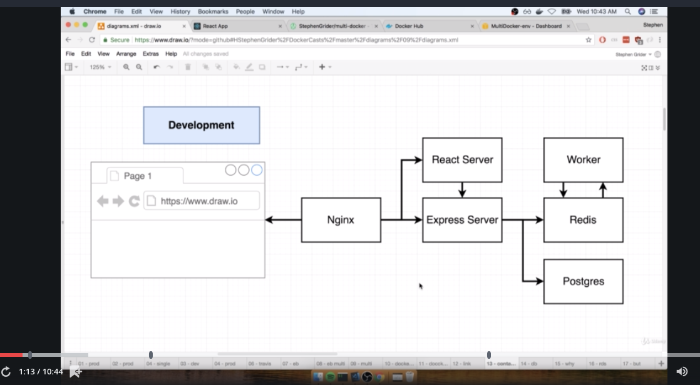

production. The middle beanstalk definitions are all in the `dockerrun.aws.json` file:

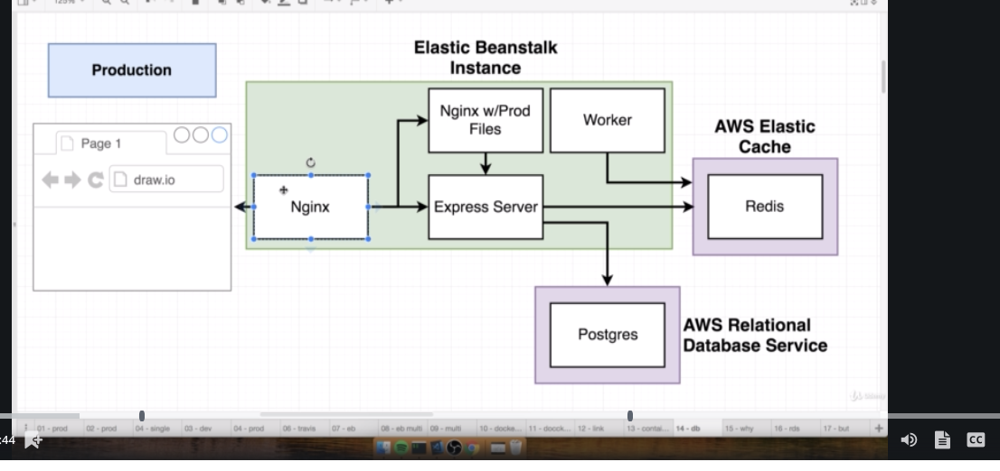

In the above image, Redis and postgres are not in ESB, they are external services. AWS RDS is for postgres and amazon elastic cache are for redis. They are general services that can be used for any application. Elastic Cache maintains Redis for us, easy to scale, built in logging.

One benefit of using ElasticCache is that it's decoupled from ESB if you want to move away from ESB. It doesn't care that beanstalk is used. All that ElasticCache cares is that it's connected to it... other services just connect to it. It's decoupled from ESB. You just connect to ElasticCache and that's all that matters.

Benefits of RDS: RDS takes backups for you which is nice. and you can rollback to it easily.

proboem:
by default, these services cannot talk to each other. The EB with 4 containers, postgres RDS, and elastic cache cannot talk to each other by default.


- in every region in AWS you get your own default vpc. It has security rules and prevents other people from using your EB service. a security group is a firewall rule. it states the rules that describe what services can connect to different services in the vpc. Security group has a bunch of firewall rules. EB by default allows incoming traffic from anywhere on port 80.

- one way to get three services to talk to each other is to create a security group that allows any other service with that security group to allow traffic to it.
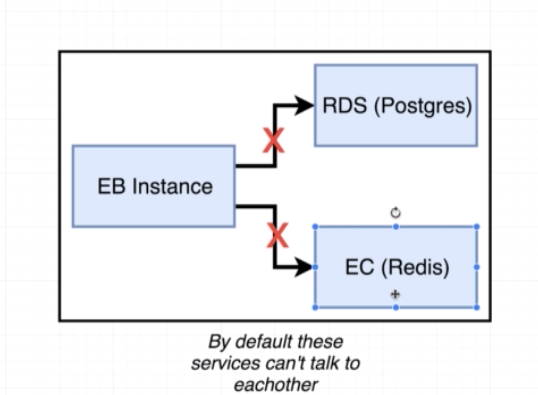


## New commands
## New Dockerfile commands


# Section 12
## Notes
- how would we scale docker applications? kubernetes.
- ESB would spin up different copies of the entire set of containers. maybe more differnet sets of containers.  More machines in a sense of the solution.

It would look like this, call it image B:

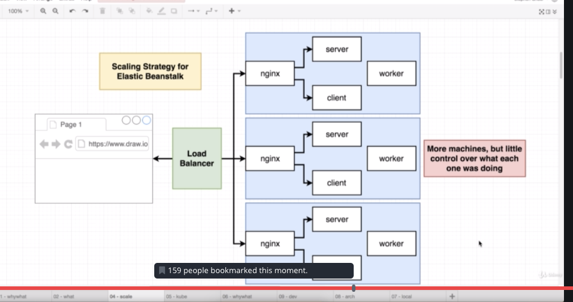

this is inefficient because we wouldn't need 3 nginx containers. Really the worker is the blocker because it's processing something that is slow. Its fibonacci calculator is slow and the bottle neck so really we just need more worker containers.


- But it'd be better if we could just spin up the worker containers since that's the slow part. Kuberentes allow us to have different machines with a lot of control over what containers they run.

Kubernetes cluster:

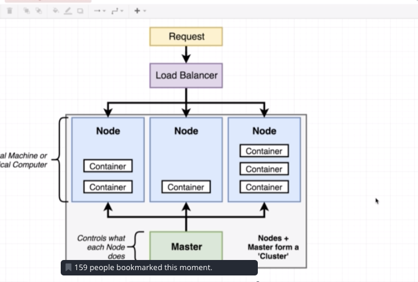

a node are a virtual machine or physical computer that is running containers, any number. each node can run different containers or different number of containers as you can see above. Can be completely different containers. So that way we can scale up just the worker image on a virtual machine.
- nodes are managing by the master. The master is what we interact with. We give directions to the master like "run 5 containers running a specific image".
- we anytime we have application of many differnet types of containers in different quantities on different computers.
- we wouldn't really find need of it where we ran the same set of containers over and over again like in image B.   


- in development, we use minikube to use kubernetes on our local machine
- in production, we use managed solution like Amazon Elastic Container Services for Kubernetes (EKS) on amazon or google cloud kubernetes (GKE). Or you could do it yourself instead of a managed solution.

- minikube will create a virtual machine that will run containers. minikube creates that virtual machine. We will use kubectl which is a program that will interact with a kubernetes cluster. It tells a virtual machine or node what containers it should be running. 
- minikube creates and runs a cluster on the local machine.
- kubectl is used locally or in prod since it interacts with any cluster, local minikube or prod.
-if you just have multiple different types of containers, kubernetes is a good choice. If just one type of container, k8 is not a good choice.

- section 12 gets the multi-client image running on a k8 cluster, just that one image.

- differences between docker and k8:

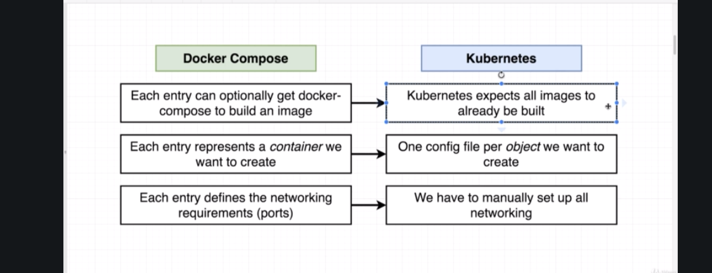

- in the above, we see that k8 expects the images to already be built.
- in k8, we have multiple config files for each objecg we want to create. one config file per object (an object is not necessarily a container).
- in k8, we have to manually set up networking. in docker-compose we can easily connect to other containers using docker-compose.

- What is an k8 object? It's not a container exactly. kubectl will create objects. An object is anything that exists in a k8 cluster.  Pods and Services are objects that are in the cluster. They have different purposes. A k8 pod will run a container. Services setup networking in our cluster.

- What is api version? It's a way to give us access to predefined object types in our k8 config file:

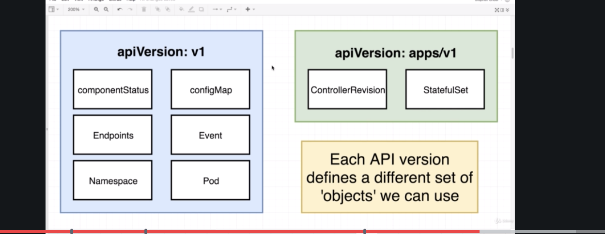
- types of objects that we specify that we can specify that we want to create in any config file.


- what is a pod and node:

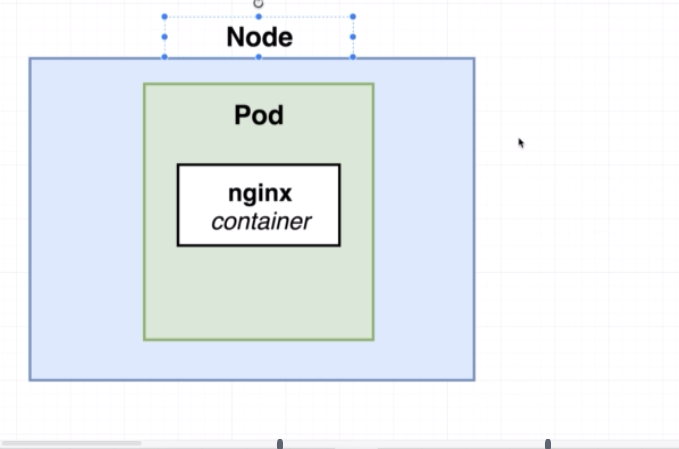

- a virtual machine is a node. a node will be used by k8 to run some number of objects. basic objects are pods. Pods run in nodes or virtual machines. POds are grouping of containers with a common purpose. 
- smallest thing that can be deployed is a pod. You cannot deploy containers without additional overhead. 
- A pod must have one or more containers inside of it. and a pod is the smallest thing we can deploy.
- the purpose of a pod is to group containers with a similar purpose, ones that must be deployed together to work correctly. If things fail and it cauess other things to fail, they should be in the same pod. If they can fail and other containers can stil lbe up, they should probably be in separate pods. Must be executdd with each other... they would be in the pod. If the pods were depenedent on each other, that' why multiple containers would be in a pod. If one pod goes away, other pods might become useless... that's a sign that the containers are coupled.


- The Service config sets a type. That type can be: NodePort, ClusterIP, LoadBalancer, Ingress. A NodePort service expose a container to the outside world... allow us to access the container via web browser. It's only for development services with an exception which will be covered later.
- Remember our client has a nginx server listening at port 3000 which is directed to by the service. This is our architecture:

- the service talks to the pod via label selector system.  It looks for a key value of component:web and directs traffic to it.
In the service:
```yml
  selector:
    component: web
```

in the pod:

```yml
 labels:
    component: web
```

the selector in the service is matched with a label in teh pod. The key:value of component:web is arbitrary btw and could be any key vlaue pair. `label` and `selector` are keywords though.


ports in the service:
```yaml
spec:
  type: NodePort
  ports:
    - port: 3050
      targetPort: 3000
      nodePort: 31515
```

the first port is useless in our application. It is the port that another application in the cluster could use to connect to port 3000.
- targetPort is the port in the pod that we want to open up traffic to in the pod. 3000 means any traffic is sent to port 3000 in the pod.
- nodePort is the most important. it's the port developers will use to test out the pod. We can type the port in the browser to access the pod. 
any requests to the nodePort get sent to the targetPort.

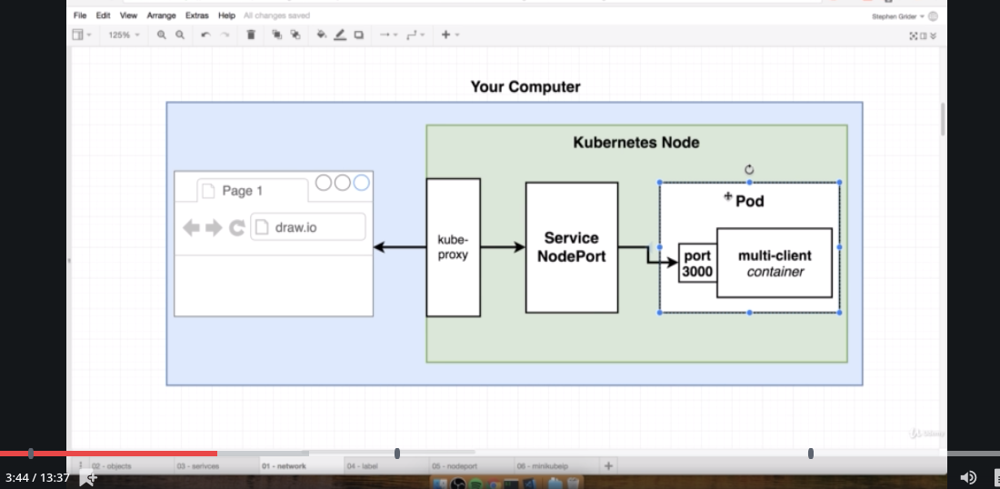 

the kube proxy is the window to the outside world.  It directs requests to the correct service. The port 3000 is specified by teh target port in the service. 


- so you can't just go to `localhost:31515` where the number is the NodePort, because the virtual machine where the cluster is is not addressed by localhost. all the ports in teh vm are not on localhost. You need to ask minikube what the IP is of the virtual machine. You need to visit that IP address. type in `minikube ip` and use that IP. You cannot use `localhost` period.

- evne if you kill a docker container, kubernetes brings it back you can see if the restarts increases by 1.

- the k8s master has a list of responsibilities from the config file and the master fulfills those responsibilities. The master is constantly polling the nodes and anytime something happens in the node, the master gets a notification like when a container dies and then the list of responsibilities and state in the master is updated. We work directly with the master when we deploy a config file using `kubectl`. 

- each k8 virtual machine has a copy of docker. on our computer we have two versions of docker then, one on our computer, and one on teh virtual machine which is just a neat fact.

Imperative vs Declarative:
- we tell k8s what we want. imperative: we issue a series of commands to create container/delete/restart or whatever. declarative: we tell/give guidance master the state we want and the master figures it out:

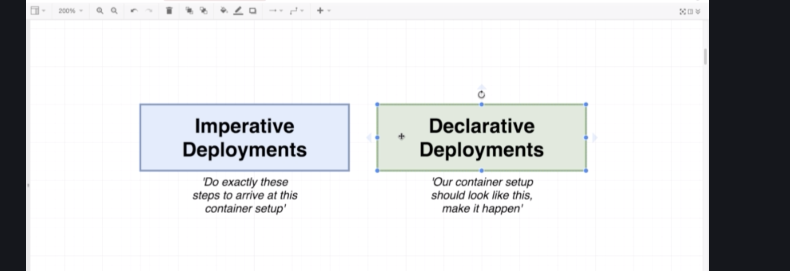


imperative:

the problem is what we have to 1. figure out current state and update the state *depending* on that state. it requires computation out of us. we have to research current state, and come up with a migration path to take us from current state to desired state. That's a lot of work from us. An imaginary example:

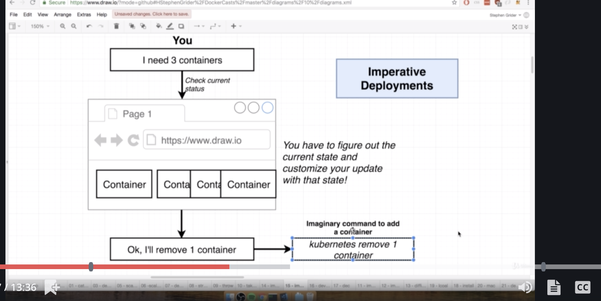


in declarative, the k8s master takes care of it the state. We don't have to care about the current state.

- k8s has a way to do both imperative and declarative. `kubectl` commands via the command line is imperative. k8s also has declarative. We should use declarative using the config file. 
every engineer will advocate for the declarative approach, it's easier.


## New commands

`kubectl apply -f <file>`
the -f allows us to specify a file name. 
- the above command allows us to apply changes to our k8 cluster.
- `apply` means we will change config of our cluster.

```text
 kubectl apply -f client-pod.yaml
pod/client-pod created
✔ 11:13 ~/simplek8s [master L|●2…1] $ kubectl apply -f client-node-port.yaml
service/client-node-port created
```
 did it work? Let's check the status with `kubectl get pods`. `get` is a way to get information about an object.
 
 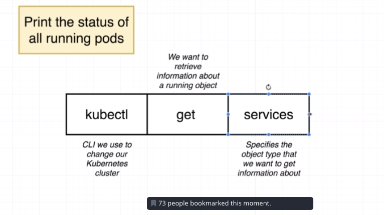
 
 
 output below:
 
 ```text
kubectl get pods
NAME                                READY   STATUS    RESTARTS   AGE
client-pod                          1/1     Running   0          51s
health-checker-5f9d7c8854-lkjzw     1/1     Running   0          78d
webapp-deployment-fb5f494c5-m97nz   1/1     Running   0          78d
webapp-deployment-fb5f494c5-z9lhv   1/1     Running   0          78d
```


# Section 13
## Notes

point of this section is to declaratively update a k8s cluster image to a different image.

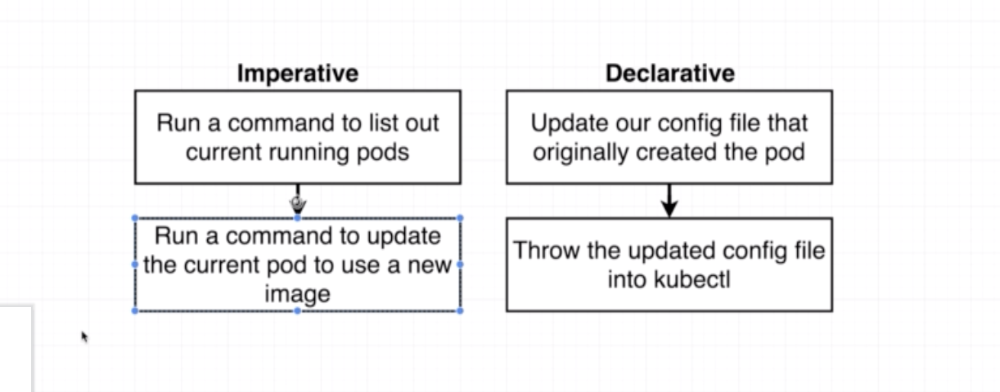

- k8s determines which pod to update using the config file name and type. If the config matches with an object in the cluster, it will update instead of creating a new one. Master will match with the config and if it is found, it will update. So just update the config file with say a new image but keep the name and type the same and just run `kubectl apply -f client-pod.yaml` to update. You can update a pod's config's image but not port. To update the port, you need to use a deployment, not a pod.
- Once a pod has been a created, you cannot update the pod's port. But, use a deployment object instead.
 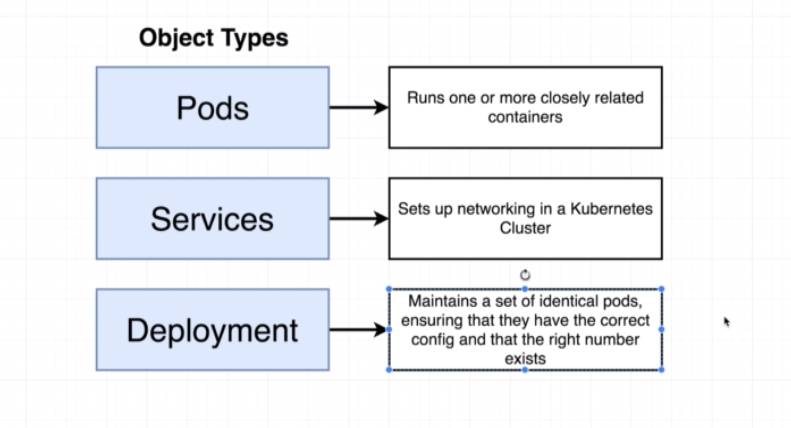. 

- A deployment maintains a set of identical pods. deployment and pods can run containers. a pod runs a single set of containers that are integrated with each other. only for development. rarely used in production because of limitations of updating its config. Deployments are good for dev and production. Deployments runs set of identical pods each with identical containers with identical configs.  Deployments are used in production and are used much more often than pods. Forget about pods. Deployments use pods. When we create a deployment, it is attached to a pod template which is used to create a pod. Deployments use pod templates to create pods. If we change the pod template, the pod is changed. with a deploymenet, you can update any piece of config.

- remember to connect, we run `minikube ip`, and then connect tothe nodeport.

- services are usefulbecause they match to pods with selectors and route traffic to it, regardless of whether the pod is recreated with a new IP. services abstract out that difficulty of connecting to pods. We can connect to teh port associated with the service and the service will connect us to the port. Pods do have their own IP but if htey are torn down or recreated, the IP will cahnge so having to manually connect to the new IP is painful. Services do that work for us and we just have to connect to the service IP 31515 that we manually assigned. Every pod has an IP address and is internal inside the virtual machine and assigned to the pod.

- when changing a deployment, the pod gets deleted and recreated instead of updating the pod. When you change the deployment port number, that's what happens. 


- when updating a deployment, update the file, and apply it, and you can run `kubectl get deployment` to see the new deployment. Or `kubectl describe deployment`. When you update an image, how would you update the deployment though?

- we will update the image with a version number and send it to docker hub, and issue an imperative command to k8 to find the new image instead of changing the config file. Downside: config and deployment are out of sync. 
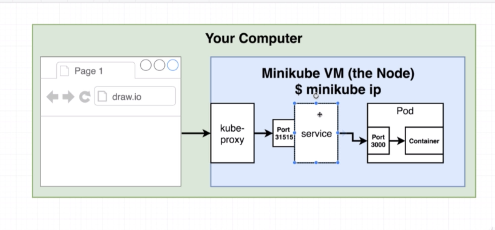


## New commands

- to look at pod's containers:

`kubectl describe <object-type> <object-name>`

- the above gets detailed info like a pod's containers.

- `kubectl describe <object-type>` to get info about all of that object type.


```text
apiVersion: apps/v1
kind: Deployment
metadata:
  name: client-deployment
spec:
  replicas: 1
  selector:
    matchLabels:
      component: web
  template:
    metadata:
      labels:
        component: web
    spec:
      containers:
        - name: client
          image: jwan622/multi-client
          ports:
            containerPort: 3000
```

- `replicas` refers to the number of pods that the deployment makes... each pod is identical. the master create the pod using the template section. the deployment gets the pod it is supposed to control using the `matchLabels` section. That' what the selector and the metadata are for in the template section. A pod might have multiple labels and the selector can very selectively get only certain pods with certain labels using the `matchLabels` property.

```yaml
selector:
    matchLabels:
      component: server
```

- the template section is the config for every single pod created by the deployment. the template looks exactly like a pod deployment config.

- `kubectl delete -f <config_file>`. will delete that object. kubectl will look at the file and use the kind and name, and deletes the object with the same name and kind. This is an imperative command.

- `kubectl set image <object-type> / <object-name> <container-name> = <new-image>`

- the `container-name` is the name of the container which the master will use to find the containers to update inside the deployment's pods. each pod could have many different containers and so the name is a way to specify the container.
- the object-type is deployment and the object-name is client-deployment


to reconfigure Docker cli in a terminal window:

```bash
eval $(minikube docker-env)
docker ps
```

`minikube docker-env` sets environment variables that docker cli uses. It most importantly sets the docker host:

```bash
 minikube docker-env
export DOCKER_TLS_VERIFY="1"
export DOCKER_HOST="tcp://192.168.99.100:2376"
export DOCKER_CERT_PATH="/Users/jwan/.minikube/certs"
# Run this command to configure your shell:
# eval $(minikube docker-env)
✔ 16:30 ~/complex/client [master|✚ 1…1] $ minikube ip
192.168.99.100
✔ 16:30 ~/complex/client [master|✚ 1…1] $
```

why would you do this? you can get logs like docker logs <containerid> for a container inside the k8s cluster. or run `docker exec -it <container-id> sh


# Section 14
## Notes

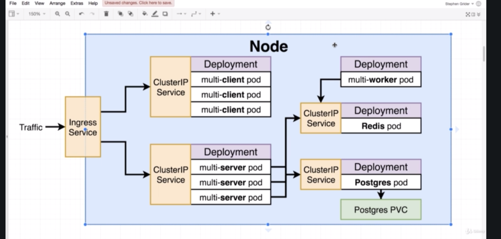

- a node port exposes a set of pods to theo utside world whereas a ClusterIP exposes set of pods to other objects in the cluster, but nobody in the outside can access the object that the service is pointed to. ClusterIP cannot allow access to the object from the outside world. We need an Ingress Service to access the pod. So a clusterIP service points to an object and allows access to it from everything else in the deployment.

- so again, the clusterIP is when we don't want the object accessible to the outside world. But if it's accessible to the IngressService, it's accessible to the outside world through the Ingress Service.

- worker doesn't have a clusterIP because nothing needs to connect to it. IT's going to connect to something else. It connects to redis. No request goes into the worke so we don't need a service.

```yaml
ports:
    - port: 6379
      targetPort: 6379
```

- any outside object thati s trying to get to the associated object to teh clusterIP`port` is going to go through `port` and forwarded to `targetPort`. After it goes through the ClusterIP service, it will connect  to the container via the `targetPort`. 

- the postgres pod has to have a connection to a postgres PVC, a persistent volume claim. Same kind of volume as a docker compose volume which allows us to share files between out local host machine and docker container. Updates on the machine updated files in the container. What is a volume? A volume We need one for postgres because if the container's (postgres) crashes, then the filesystem is lost including the filesystem in the postgres container. If postgres crashes, we need a volume to persist on the local machine. the k8 deployment will recreate a new postgres contaienr with no persisted files or carryover data. How do volumes help? the files for postgres will write to the host machine on the volume so that when the container crashes, a new pod will be recreated that will use the files on the local machine volume. The volume will be on the host machine and this will keep the files persisted even in the event of a crash.
- However, one quick thing is that there can only be one replica of postgres with one volume. YOu cannot have two replicas for 1 volume. This will not work well and they need to cooperate with each other for this to work. More config is necesssary to have 2 containers for 1 volume.
- a kubernetes volume is an object in the kubernetes world. We can write a config for it. That object allows a container to store data in the pod level, not the local machine like a container volume. There are also two concepts called a persistent volume  or a persistent volume claim, not a volume. It's different from a docker volume which is on the local machine. K8s volumes are on the pod. So there are volumes, PVC, and persistent volumes. We will use a k8s volume.


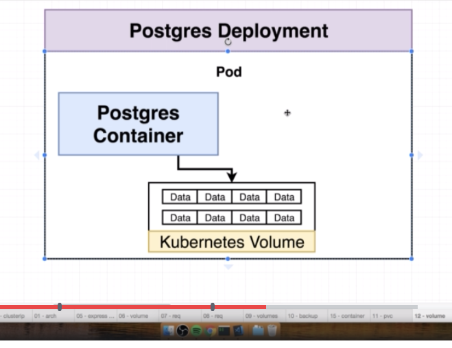

- the voluem is data storage inside/associated the pod. Can be accessed by any container in the pod. BUT if the pod dies, the volume dies and goes away as well. Volumes survive container restarats but not pod restarts. Then the deployment would kick and recreate the pod with a fresh volume. So we can't use kubernetes volumes for postgres. We need something else. 
- persistent volume vs volume:

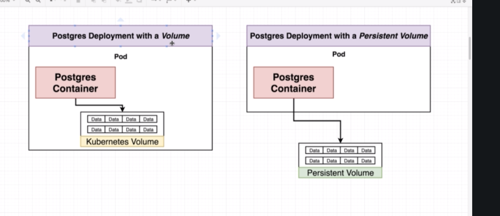


## New commands

`
