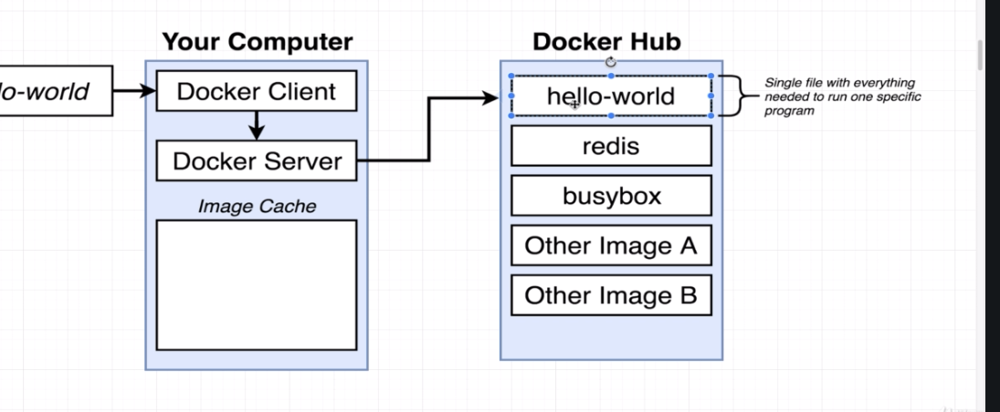
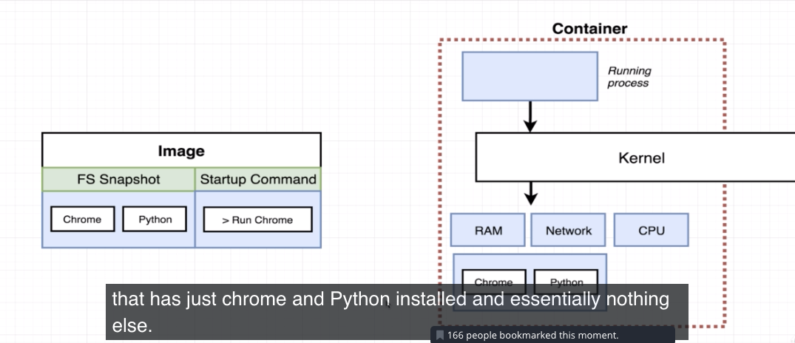

**Docker how it works**:

the __docker run__ command looks like local images first and if it can’t find them, looks to docker hub.

Docker makes use of a container, which you think of as a allocated amount of system reosurces devoted to a process or set of process.

The kernel looks at the system call and looks at the calling application and directs it to a segment of the computer resources. Called namespacing. Namespacing allows you to devote hardware resource to a the calling process. It isolates resources per process.

A control group can limit the amount of hard resources a process can use. It can limit how much cpu and memory a process can use. even network bandwidth.

control group and namespacing together can really affect processes. A container from docker utilizes both of these. a container is a grouping of processes that have a grouping of resources assigned to it.

hello
The kernel is repsonsible for looking at the process system call and directing it to the necessary resources.

this is what happens when you run docker run.

and this is how a container would work

